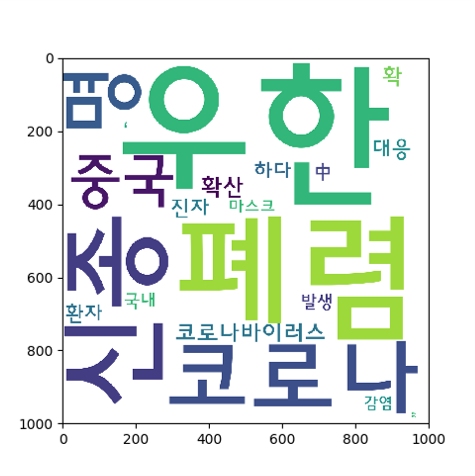
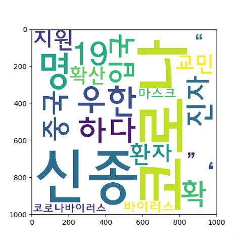
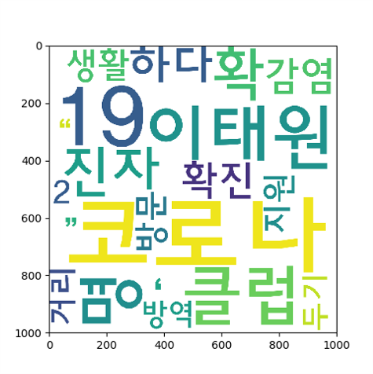
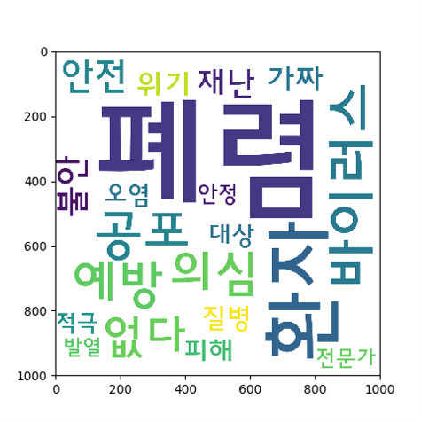
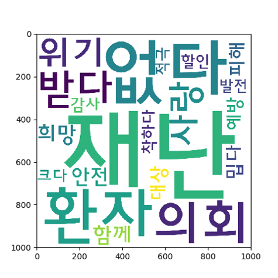

# 2020-1_capstone-design
[2020-1] Data Mining Project for IMEN330 Course

## Topic
Sentimental Analysis on COVID-19 Headline Keywords

## Data
Crawled 462,567 headlines from [NAVER news](https://news.naver.com/)
- Keywords: '코로나', '우한 폐렴'
- Date: 2020.1.10 ~ 2020.5.14 (126 days)

## Sentiment Lexicon
[KNU 한국어 감성어 사전](http://dilab.kunsan.ac.kr/knusl.html)

## Sentiment Indicators

  
  

to be updated

## Data Flow
 

  

 
 

  

 
 

  

 
 

  

## Result

### Keyword Information

  

### Sentiment Indicators

  
  
  

### Word Cloud

  
  
  
  
  

  
  
  
  
  

  
  
  
  
  

+ size, caption
